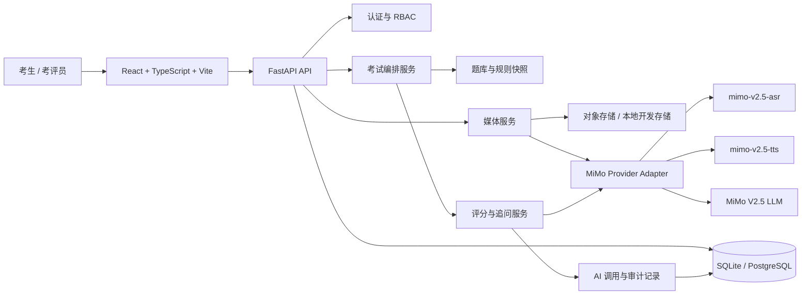
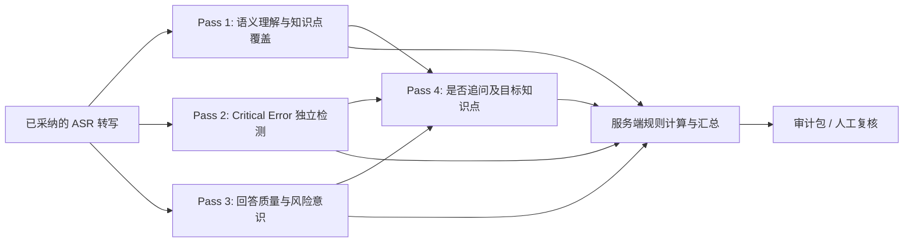

# 系统架构与 API 设计

> Sprint 1A 更新：评估 LLM 通过 `LLMProfile` 快照选择可插拔 Provider。MiMo 保留语音栈；其
> `mimo-v2.5` 评估 Profile 因 Full Qualification 失败而不可作为正式 Judge。详见
> [multi-provider-design.md](multi-provider-design.md)。

## 1. 架构原则

- **规则优先**：题库管理员维护的版本化评分规则是唯一评分依据；LLM 负责语义匹配与解释，不创造规则。
- **服务端边界**：浏览器仅与 FastAPI 通信；MiMo API、数据库和对象存储均只由后端访问。
- **可审计**：每次模型调用都保留输入快照、模型/提示词版本、原始输出、解析输出和关联业务对象。
- **可替换**：语音和 LLM 能力通过 Provider Adapter 隔离，业务服务不依赖 MiMo SDK 细节。
- **可演进**：以 SQLAlchemy + Alembic 管理关系模型，开发使用 SQLite，生产使用 PostgreSQL。

## 2. 逻辑架构



## 3. 后端模块边界

| 模块 | 责任 | 不负责 |
| --- | --- | --- |
| API Router | 身份校验、请求校验、响应契约 | 评分业务逻辑、直接调用供应商 |
| Exam Service | 考试状态机、题目顺序、追问上限、完成判定 | LLM 提示词细节 |
| Question Bank Service | 题目、评分规则和版本发布 | 考生作答与成绩修改 |
| Media Service | 上传校验、音频元数据、受控访问、TTS 缓存 | 评分判断 |
| ASR Adapter | MiMo ASR 请求/响应标准化 | 保存考试状态 |
| Scoring Service | 编排四阶段分析、schema 校验、规则计算、追问决策 | 修改题库标准、为了成本压缩关键分析阶段 |
| Review Service | 人工复核、最终决定与理由 | 更改历史 AI 记录 |
| Audit Service | 模型调用、事件和版本追踪 | 业务规则决策 |

## 4. 考试状态机

考试状态的唯一规范是 [exam-state-machine.md](/Users/lucky/Documents/ChatGPT/放行人员口试/docs/exam-state-machine.md)。架构层仅约束：服务端持久化 `ExamAttemptState` 与 `AttemptItemState`、使用 `state_version` 进行乐观并发控制；浏览器的 `RECORDING` 仅是 UI 状态；所有外部调用失败进入规范中定义的可恢复路径，绝不静默给分。

## 5. 项目目录结构

以下为目标目录结构；本次仅创建 `docs/` 中的设计文档。

```text
.
├── docs/
│   ├── PRD.md
│   ├── architecture.md
│   ├── data-model.md
│   ├── scoring-design.md
│   ├── exam-state-machine.md
│   ├── mimo-integration.md
│   ├── api-design.md
│   ├── frontend-design.md
│   ├── testing-strategy.md
│   └── risks.md
├── backend/
│   ├── app/
│   │   ├── api/v1/             # 路由与请求/响应 schema
│   │   ├── core/               # 配置、安全、日志
│   │   ├── db/                 # session、base、初始化
│   │   ├── models/             # SQLAlchemy ORM
│   │   ├── repositories/       # 数据访问
│   │   ├── schemas/            # Pydantic DTO / AI JSON schema
│   │   ├── services/           # 考试、评分、复核业务
│   │   ├── ai/                 # Provider 抽象与 MiMo 适配器
│   │   ├── scoring/            # 规则引擎、Pass 编排、最终评价
│   │   ├── exam/               # 考试状态机、组卷和恢复
│   │   ├── audio/              # 上传、存储、ASR、术语标准化、TTS
│   │   ├── prompts/            # 版本化提示词模板
│   │   └── main.py
│   ├── alembic/
│   ├── tests/
│   ├── pyproject.toml
│   └── alembic.ini
├── frontend/
│   ├── src/
│   │   ├── api/                # 后端 API client
│   │   ├── components/
│   │   ├── features/           # exam、question-bank、review、auth
│   │   ├── hooks/
│   │   ├── pages/
│   │   ├── routes/
│   │   ├── types/
│   │   └── main.tsx
│   ├── public/
│   └── package.json
├── infra/
│   ├── docker/
│   └── env.example             # 仅变量名，无真实密钥
├── scripts/
└── README.md
```

## 6. REST API 设计（v1）

所有接口位于 `/api/v1`，使用 JSON；音频上传使用 `multipart/form-data`。需认证的接口使用服务端会话或 Bearer Token。错误统一使用 `{ "code", "message", "request_id", "details" }`。

| 方法与路径 | 用途 | 主要响应/约束 |
| --- | --- | --- |
| `POST /auth/login` | 登录 | 返回会话/令牌与当前用户角色 |
| `GET /me` | 当前用户 | 返回最小必要个人与权限信息 |
| `GET /exam-plans` | 可参加考试列表 | 按角色过滤 |
| `POST /exam-plans/{id}/attempts` | 开始考试 | 创建锁定快照，返回当前题目 |
| `GET /attempts/{id}` | 考试进度 | 返回状态、当前步骤、时间限制 |
| `POST /attempts/{id}/items/{item_id}/present` | 标记题目已呈现 | 返回题干、TTS 音频受控 URL |
| `POST /attempts/{id}/items/{item_id}/answers` | 上传回答音频 | 创建回答记录，异步/同步驱动 ASR 和评分 |
| `GET /attempts/{id}/items/{item_id}` | 轮询题目处理结果 | 返回转写、评分状态、下一步，不泄露内部提示词 |
| `POST /attempts/{id}/items/{item_id}/retry-asr` | 请求重新转写 | 保留原回答与重试关系 |
| `POST /attempts/{id}/items/{item_id}/next` | 确认进入下一步 | 仅当前题已终结时允许 |
| `POST /attempts/{id}/complete` | 完成考试 | 计算汇总，返回结果 ID |
| `GET /results/{id}` | 考生查看结果 | 返回允许公开的题级和总分信息 |
| `GET /review/attempts` | 待复核列表 | 仅考评员/管理员 |
| `GET /review/attempts/{id}` | 完整审计包 | 含规则快照、原始音频访问授权、ASR、AI JSON |
| `POST /review/attempts/{id}/decisions` | 提交人工复核 | 追加记录，不更新 AI 原始结论 |
| `GET/POST /admin/questions` | 题库查询/创建草稿 | 管理员；创建不等同发布 |
| `POST /admin/questions/{id}/versions` | 创建版本 | 包含结构化规则 |
| `POST /admin/question-versions/{id}/publish` | 发布版本 | 校验评分规则完整后不可编辑 |

### 6.1 评分结果的 API 视图

后端向前端返回经过校验的评分摘要，例如：

```json
{
  "state": "FINALIZED",
  "score": 72,
  "critical_error": {"status": "NOT_TRIGGERED", "matched_rule_ids": []},
  "matched_point_ids": ["M1", "I2"],
  "missing_point_ids": ["M2"],
  "follow_up": {"required": true, "count": 1, "question_text": "请说明……"},
  "review_required": false
}
```

原始模型请求、完整响应和内部提示词不向考生 API 返回，只在授权复核接口中提供。

## 7. 前端页面设计

| 页面 | 面向角色 | 核心内容 |
| --- | --- | --- |
| 登录页 | 全部 | 账号登录、隐私/录音告知 |
| 考试列表页 | 考生 | 可参加计划、说明、时长、开始入口 |
| 考试说明页 | 考生 | 规则、麦克风检测、录音授权、开始确认 |
| 口试工作台 | 考生 | 当前题目文本、TTS 播放、录音控件、上传/处理状态、有限提示；不展示评分细节 |
| 处理中/异常页 | 考生 | ASR/评分进度、重试录音、联系考评员入口 |
| 考试结果页 | 考生 | 总体结果、题目完成情况、复核状态；展示粒度由考试规则控制 |
| 复核队列页 | 考评员 | 待复核原因、风险标签、筛选和排序 |
| 复核详情页 | 考评员 | 左侧题目与标准快照，右侧音频/转写/AI JSON/人工结论，所有版本可见 |
| 题库管理页 | 管理员 | 题目草稿、版本、发布状态、评分规则校验提示 |

工作台应在录音时显示时长和隐私提示；在请求处理中禁用重复提交，并给出可恢复的网络失败状态。考评员页面必须清晰区分“AI 建议”和“人工最终结论”。

## 8. V1 多阶段评分编排

同一道回答在 V1 采用四次彼此独立、可审计的 LLM 分析。它们可以共享只读的题目、规则快照和转写，但每个 Pass 必须有独立的提示词版本、输入/输出、状态和调用记录。



Pass 2 只能按 `critical_errors` 规则集工作，不能依赖 Pass 1 的“无错误”推断。Pass 4 可读取前 3 个 Pass 的结构化结果以选择追问重点，但不得创建新的评分标准。V1 默认不做以节省调用为目的的合并、降级或模型结果缓存；任何改动需以金标集和人工复核对比证明可靠性不降低。

## 9. 音频、AI 与错误恢复数据流

1. 浏览器仅向后端上传录音、获取受控音频 URL 和轮询考试状态。
2. `Media Service` 固化原始音频并生成哈希；ASR 返回原始结果后，词典标准化服务生成可回溯的 `asr_normalized_text`。
3. 评分服务针对标准化文本执行四个 Pass，将每个 Pass 的原始结构化响应与 Prompt/模型/标准快照关联。
4. 服务端规则引擎汇总出分数与复核标记；最终题目评价基于完整会话链，绝不平均多次回答分数。
5. 外部依赖失败会被持久化为可恢复状态。TTS 失败降级为题干文本；ASR 或 LLM 失败允许安全重试，绝不自动判负；页面刷新后由 `GET /attempts/{id}` 恢复服务端状态。

## 10. 组卷、快照与持久任务

考试计划以 `ExamPlan → ExamPlanVersion → ExamBlueprintSection → ExamQuestionPool/ExamSelectionRule` 表达。创建 Attempt 时在事务内锁定计划版本、按蓝图选择题目版本、写入 `plan_snapshot`、`question_snapshot` 与 `rubric_snapshot`；历史结果绝不读取当前计划或题库。

ASR、TTS、Coverage、Critical Error、Quality/Risk、Follow-up 和 Final Assessment 均为具有业务唯一键的持久化 `TaskJob`。worker 可横向扩展或在开发环境简化，但任务恢复、重试和去重由数据库状态和唯一键保证，不依赖进程内 BackgroundTasks。

## 11. 技术演进边界

Provider 抽象预留 RAG 辅助证据与双 Judge 接口，但 V1 仅接入 MiMo 和单 Judge。任何未来 RAG 检索结果只能辅助考评员或题库维护，不能成为 AI 自行修改正式评分标准的依据。
