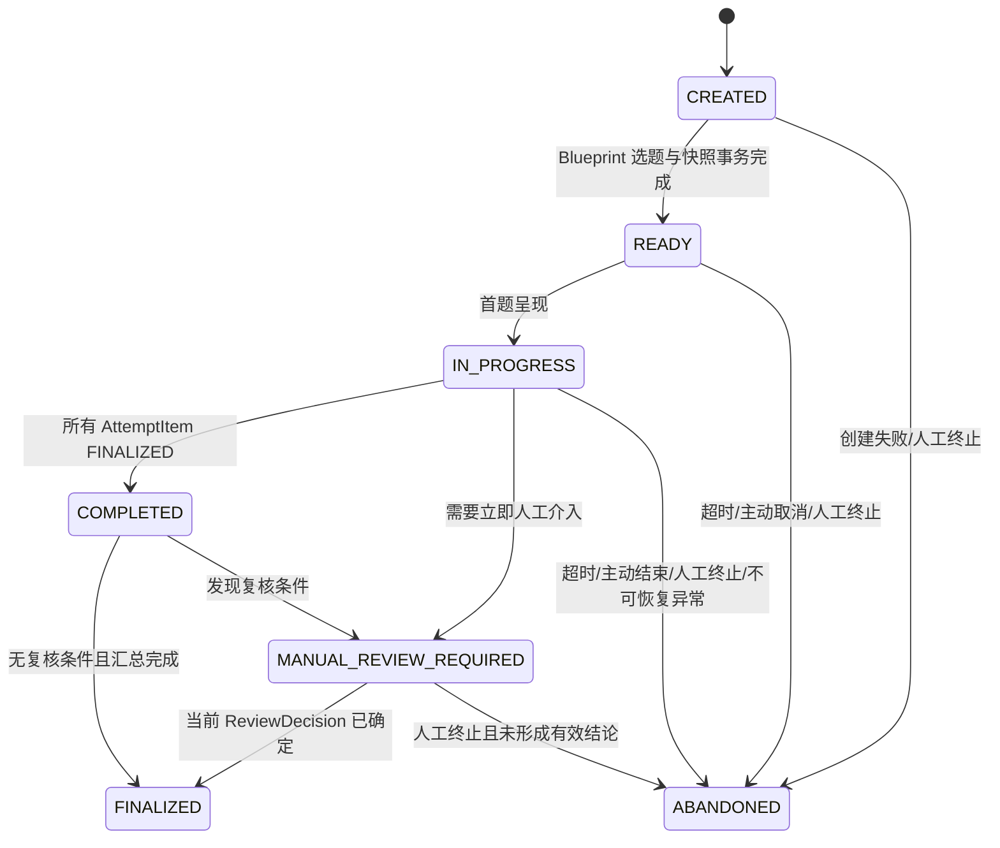

# 考试状态机设计（唯一规范）

> Status: ACTIVE
> Owner: 考试编排负责人
> Last Reviewed: 2026-08-16（Phase 0 Governance Baseline）
> Source of Truth For: `ExamAttemptState` 与 `AttemptItemState` 的全部状态与迁移（唯一规范）

本文件是考试状态的唯一规范。`PRD.md` 与 `ARCHITECTURE.md` 只引用本文件，不维护另一套状态枚举。状态以服务端为唯一事实来源；`RECORDING` 只是浏览器 UI 状态，绝不持久化为业务状态。

状态新增/修改必须经过 ADR（见 `adr/README.md`）或明确架构变更授权；业务代码不得随意增加数据库状态。

## 1. ExamAttemptState

| 状态 | 含义 | 允许的主要迁移 |
| --- | --- | --- |
| `CREATED` | 创建请求已接受，尚未完成组卷快照 | `READY`、`ABANDONED` |
| `READY` | 计划版本、蓝图与题目快照均已锁定 | `IN_PROGRESS`、`ABANDONED` |
| `IN_PROGRESS` | 正在处理至少一个题目 | `COMPLETED`、`MANUAL_REVIEW_REQUIRED`、`ABANDONED` |
| `COMPLETED` | 全部题目已完成，考试汇总待定或已产生 | `MANUAL_REVIEW_REQUIRED`、`FINALIZED` |
| `MANUAL_REVIEW_REQUIRED` | 存在需人工处理的结果 | `FINALIZED`、`ABANDONED` |
| `FINALIZED` | 当前人工/规则最终结论已确定，只读 | 无 |
| `ABANDONED` | 超时、考生主动结束、人工终止或不可恢复异常终止 | 无；仅可创建新的 Attempt |

`ABANDONED` 必须记录 `abandoned_reason`，取值为 `timeout`、`candidate_ended`、`terminated_by_reviewer`、`unrecoverable_failure` 或受控扩展值。短暂网络/worker 故障不进入 `ABANDONED`；保留在原状态或题目 `NEEDS_ATTENTION`，待恢复。

## 2. AttemptItemState

| 状态 | 进入条件 | 允许动作 | 退出条件 |
| --- | --- | --- | --- |
| `PENDING` | 尚未成为当前题 | 无 | 前题完成 |
| `PRESENTING` | 当前题被签发 | 请求/读取 TTS、文本降级 | 题干已展示 |
| `WAITING_FOR_ANSWER` | 等待主答 | 上传主答、重听 | 有效主答被创建 |
| `ASR_PROCESSING` | 有待采用的回答音频 | ASR、采用转写、重新录音 | 转写被采用或需要处理 |
| `ANSWER_ANALYZING` | 存在已采用转写 | Coverage、Critical Error、Quality/Risk 任务 | 相关任务成功或需要处理 |
| `FOLLOW_UP_PENDING` | Pass 4 建议追问且次数 < 2 | 创建追问任务/记录 | 追问已签发或改为最终评价 |
| `WAITING_FOR_FOLLOW_UP` | 已展示追问 | 上传追问回答、重听 | 有效追问回答被创建 |
| `FINAL_ASSESSING` | 无追问、已达上限或人工停止追问 | final assessment 任务、服务端重算 | 最终点状态/分数持久化 |
| `FINALIZED` | 当前题评价与分数已保存 | 只读 | 下一题或考试完成 |
| `NEEDS_ATTENTION` | ASR/LLM/任务/冲突无法安全自动恢复 | 受控重试、采用其他转写、人工复核 | 返回前一可恢复状态、`FINAL_ASSESSING` 或考试复核 |

`PRESENTING → WAITING_FOR_ANSWER` 不依赖 TTS 成功：TTS 失败必须保存失败任务并以题干文本降级。`WAITING_FOR_FOLLOW_UP` 的回答完成后回到 `ASR_PROCESSING`。在任一有效回答中出现 Critical Error `TRIGGERED` 后，后续追问只能补充证据或知识点，不能由 AI 自动清除该状态。

## 3. 并发、恢复与幂等

- `exam_attempts.state_version` 与 `attempt_items.state_version` 每次状态迁移递增；命令需携带预期版本，冲突返回当前状态而非覆盖。
- 创建考试、上传回答、采用转写、签发追问、重试任务、提交人工决定均使用 `IdempotencyRecord`。同一 actor、key、request hash 必须返回首次响应。
- 持久化 `TaskJob` 是所有 ASR/TTS/LLM 工作的调度事实；进程重启后从 `PENDING`/`RETRY_WAIT` 恢复。FastAPI BackgroundTasks 只能作为开发触发器，不能是生产可靠性前提。
- 页面刷新只读取 `GET /attempts/{id}` 的服务端 `state`、`state_version`、当前题目和允许动作；浏览器不得自行推进状态。

## 4. 异常策略

| 情形 | 持久化结果 | 恢复规则 |
| --- | --- | --- |
| ASR 失败/超时 | `TaskJob=RETRY_WAIT/FAILED`，旧音频/转写保留 | 可重试 ASR、选择已存在转写或重录；评分前必须明确采用一个转写 |
| LLM JSON 无效/超时 | 相应 Pass 任务失败，保留原始响应/错误 | 有限重试；仍失败进入 `NEEDS_ATTENTION` 与复核队列 |
| 词典更新后恢复 | 使用已有 normalization 的词典版本 | 不重新套用当前词典改写历史结果 |
| 重复/并发上传 | Idempotency/业务唯一键约束 | 仅一个 Answer 成功成为当前候选；其他返回已有结果或被标为 superseded |
| Attempt 超时 | 写入终止原因和审计事件 | 转为 `ABANDONED`；不可从同一 Attempt 继续考试 |
