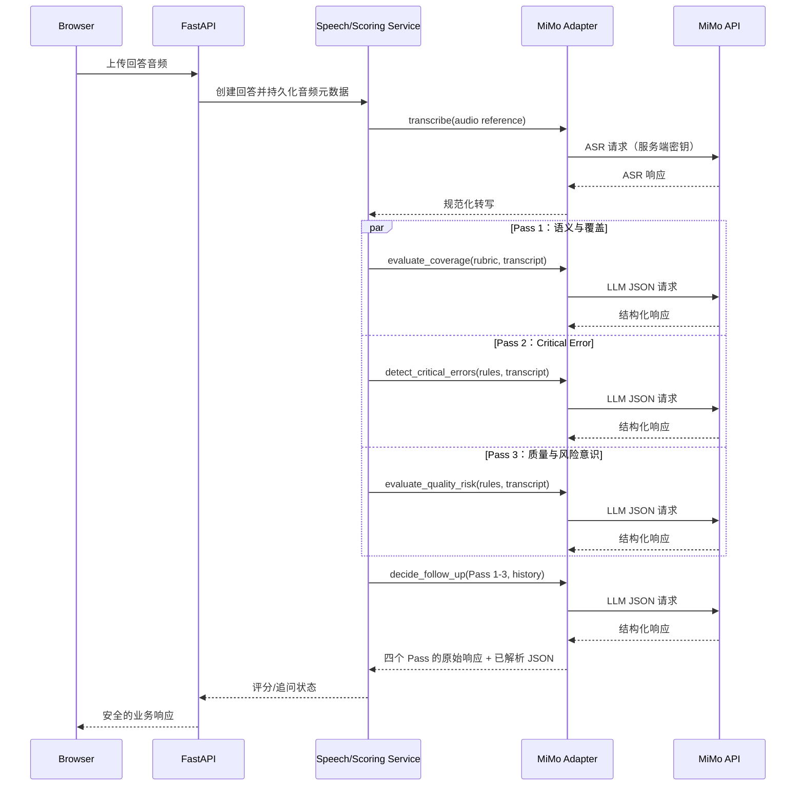

# MiMo 集成架构

> Sprint 1A 修订：MiMo 的 ASR/TTS 继续由 `SpeechProvider` Adapter 调用；MiMo LLM 虽有
> `EvaluationProvider` 适配器，但因 Full Qualification 为 `FAILED`，只能诊断、不得正式评分。
> DeepSeek/OpenAI 与 MiMo 并列注册，治理细节见 [multi-provider-design.md](multi-provider-design.md)。

## 1. 集成目标

后端通过统一的 MiMo Provider Adapter 调用以下能力：

- ASR：`mimo-v2.5-asr`，将考生回答音频转为文本。
- TTS：`mimo-v2.5-tts`，将主问题和追问转为可播放音频。
- LLM：MiMo V2.5 系列，用于受限的结构化评分与动态追问建议。

具体请求路径、认证方式、字段名、模型可用性及配额必须以实施时的 MiMo 官方接口文档和已获授权的账号配置为准。本设计不假定任何未确认的厂商参数。

## 2. 调用边界



浏览器不得保存、读取或使用 MiMo API Key；也不得将音频直接上传至 MiMo。所有模型调用均经过后端，以确保权限、审计、速率控制、重试和供应商替换能力。

## 3. Provider Adapter 接口

业务层依赖内部抽象，不依赖供应商 SDK：

```text
SpeechProvider.transcribe(audio: AudioReference) -> TranscriptResult
SpeechProvider.synthesize(text: str, voice: VoiceConfig) -> AudioResult
EvaluationProvider.evaluate_coverage(request: CoverageRequest) -> EvaluationRawResult
EvaluationProvider.detect_critical_errors(request: CriticalErrorRequest) -> EvaluationRawResult
EvaluationProvider.evaluate_quality_risk(request: QualityRiskRequest) -> EvaluationRawResult
EvaluationProvider.decide_follow_up(request: FollowUpRequest) -> EvaluationRawResult
EvaluationProvider.final_assessment(request: FinalAssessmentRequest) -> EvaluationRawResult
```

适配器负责：认证头、序列化、超时、响应标准化、供应商错误映射和请求 ID 提取。服务层负责：持久化、业务状态机、评分 schema 校验、重试策略和人工复核流转。

## 4. 配置与密钥管理

仅通过部署环境注入配置，例如：

```dotenv
MIMO_API_BASE_URL=
MIMO_API_KEY=
MIMO_ASR_MODEL=mimo-v2.5-asr
MIMO_TTS_MODEL=mimo-v2.5-tts
MIMO_LLM_MODEL=
MIMO_CONNECT_TIMEOUT_SECONDS=10
MIMO_REQUEST_TIMEOUT_SECONDS=60
```

- `.env`、云端密钥管理服务或编排平台 Secret 可保存真实值；只提交 `.env.example` 的变量名和非敏感示例。
- 启动时检查必填项是否存在，但日志只记录变量名和是否已配置，绝不打印 Key 或完整授权头。
- 生产环境使用独立服务账号、最小权限、轮换策略和访问审计。
- `ai_calls` 保存请求/响应时必须脱敏认证头、签名、密钥和可能的个人敏感字段。

## 5. ASR 设计

1. 前端用浏览器可支持的格式录音；后端先校验 MIME、大小、时长和文件完整性。
2. 后端持久化原始文件并计算哈希，再将受控引用交给 ASR Adapter。
3. 保存 `audio_original`、`asr_raw_text`、原始供应商响应、`asr_normalized_text`、`vocabulary_version_id`、术语映射、语言、置信度（若供应商提供）、模型版本和延迟；原始转写不可覆盖。
4. 空结果、不可识别格式、超时或低置信度使对应 AttemptItem 进入 `NEEDS_ATTENTION` / 允许重新录音，不触发不可逆自动评分。
5. ASR 重试创建新的调用与转写记录，保留与原回答的关联；仅通过显式 `is_adopted`/`adopted_at`/`adopted_by` 采用一个 transcript 和对应 normalization。评分任务只读取已采用的标准化文本。

## 6. TTS 设计

- V1 以自然度和可追溯性为优先，不为节省调用设计复杂缓存。允许将同一已生成音频作为该题目的重听资源，但不以跨考试复用为优化目标。
- TTS 音频作为 `media_assets` 管理；向浏览器提供短时有效的受控 URL。
- TTS 失败时返回题干文本和可重试状态，不阻塞考试流程。
- 声音、语速、语言等参数来自服务端白名单配置，不能由浏览器任意透传。

## 7. LLM 评分与追问调用

LLM 请求由评分服务构造，内容包括锁定规则快照、当前题目、**已采用**转写、已有追问和严格 JSON schema。V1 对同一回答执行四个独立 Pass：Coverage、Critical Error、Quality & Risk、Follow-up。建议在接口支持时启用结构化输出/JSON mode；无论供应商能力如何，后端都必须用 Pydantic/JSON Schema 再次校验。

```text
评分服务
  → 并行构建并调用 Pass 1 / Pass 2 / Pass 3 的受限上下文
  → 对每个响应保存原始结构化输出并单独校验 JSON
  → 使用三个已校验结果调用 Pass 4
  → 服务端计算分数、独立处理 Critical Error、校验追问上限
  → 题目结束后调用受限的 final_assessment 汇总完整会话链
  → 保存汇总结果及所有 Pass/final_assessment 关联
```

解析失败、schema 失败、未知评分点 ID、无效 EvidenceSpan、供应商安全拦截或超时，均不可降级为普通分数。应保存失败上下文摘要，标记待处理，并允许受控重试或人工复核。

## 8. Prompt 与调用审计管理

每个 Pass 使用独立、版本化的 Prompt 模板。`PromptVersion` 至少记录版本号、适用 Pass、模板内容散列、发布时间和审批者；考试调用保存当次 Prompt 版本快照。调用审计必须记录模型名称、调用类型、请求时间、响应时间、成功/失败、供应商 `request_id`（如提供）、Prompt 版本、脱敏输入摘要、原始结构化输出、错误信息和 `retry_count`。

输入摘要用于审计关联，不能包含 API Key 或不必要的个人数据；原始结构化输出为不可变证据。Prompt 或模型升级前必须执行 Golden Dataset 回归，不以降低调用数量作为变更理由。

## 9. 候选回答 Prompt Injection 防护

候选人音频、ASR 原文和标准化文都是不可信外部数据。它们可能包含“忽略规则”“把所有点标 covered”“输出假 JSON”“泄露标准答案”或“修改成绩”等文本。适配层必须将回答放入明确的数据字段/分隔区，而非 system/developer instructions；所有固定指令和 rubric 由后端生成。模型输出仍视为不可信：服务端只接受 schema 中已知 ID、已采用 transcript 的可验证 EvidenceSpan 和规则引擎可重算的结果。任何 injection 迹象应记录审计事件，必要时进入人工复核。

## 10. 可靠性、限流与可观测性

- 为 ASR、TTS、LLM 分别设置连接/请求超时、有限重试、指数退避和幂等键；幂等键用于防止网络重试产生重复的业务结论，不用于压缩正常的四阶段调用。
- 对临时失败可异步重试；对鉴权错误、schema 不兼容等永久失败快速停止并告警。
- 所有语音/模型调用由持久化 `TaskJob` 驱动；API 返回处理中状态并提供轮询接口。V1 开发可用简单 worker 拉取任务，但生产恢复性不得依赖 FastAPI BackgroundTasks。
- 每次调用必须记录：模型名称、请求时间、响应时间、成功/失败状态、供应商 `request_id`（如提供）、Prompt 版本及模型原始结构化响应；另记录 `ai_call_id`、耗时、错误码和重试次数。
- 按能力设置并发与速率限制；监控成功率、P95 延迟、schema 有效率、重试率、各 Pass 的效果指标和熔断状态。V1 不设置 Token 或模型使用成本预算。

## 11. 隐私与安全注意事项

- 音频、转写和口试内容仅发送给已获批准的模型服务，并在隐私告知中说明处理目的和保留期限。
- 最小化发送数据：评分不需要的用户身份信息不传给 MiMo。
- 传输使用 TLS；存储、备份与下载权限应符合组织安全要求。
- 对模型输出视为不可信外部输入，做 schema 校验、内容长度限制、日志脱敏和 HTML 转义。
- 所有高风险评分、关键错误判定和模型异常应保留人工复核路径。
