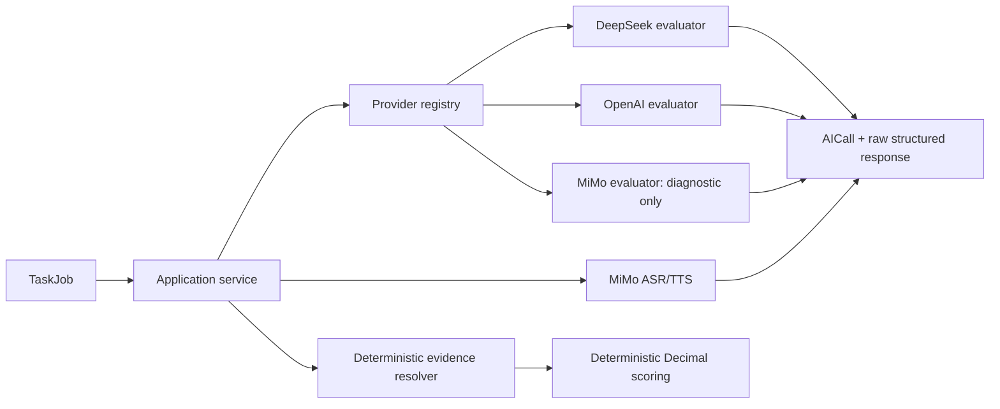

# 多 Provider 设计（Sprint 1A）

> Status: ACTIVE
> Owner: AI/Provider 架构负责人
> Last Reviewed: 2026-08-16（Phase 0 Governance Baseline）
> Source of Truth For: Sprint 1A 多 Provider 架构决策、Provider 注册表、Structured Output 契约、开发检查

## 决策

评分业务不依赖任何厂商 SDK 或 HTTP 负载。`EvaluationProvider` 和 `SpeechProvider` 是唯一的
外部模型边界；服务层只接收带类型的请求、Pydantic 验证过的输出，以及可审计的原始响应。

MiMo 继续作为 ASR/TTS Provider。根据 Sprint 0.5 Full Qualification，`mimo-v2.5` 的
Coverage、Critical Error、追问与稳定性均未达到正式 Judge 门槛，因此开发种子将它登记为
`FAILED`，不得用于正式评判。DeepSeek 和 OpenAI 以 `UNTESTED` profile 创建，必须各自经过
独立 Qualification 后才可以被治理流程标为 `QUALIFIED`。

## 调用与治理



Registry lookup is explicit and keyed by the profile snapshot. A failure raises `ProviderFailure`; the
corresponding job can be retried with the same provider or item becomes `NEEDS_ATTENTION`. There is no
cross-provider fallback. An attempt saves its profile and prompt-bundle snapshots before `READY`, so changing
the system default cannot alter an in-progress or historical exam.

## Structured outputs

Each evaluation pass has a distinct `extra="forbid"` Pydantic contract:

- Coverage: only published `point_id`, status, evidence quote, confidence and reason; no score.
- Critical Error: only `NOT_TRIGGERED` / `TRIGGERED` / `UNCERTAIN`; a trigger requires an evidence quote.
- Quality/Risk: only Quality/Risk point observations; no numeric score.
- Follow-up: boolean, targets, an open question and reason; no-answer path requires empty targets and null question.
- Final assessment: qualitative initial/final mastery and prompt dependency A–D; no numeric score.

The LLM supplies quotes only. The evidence resolver computes offsets in the adopted transcript: a zero-match
quote is `INVALID`, one match `VALID`, and multiple matches `AMBIGUOUS`. Only `VALID` evidence can support
formal covered/partial or critical-error-triggered records.

## Vendor protocol notes

The OpenAI adapter uses the Responses API with strict `text.format: json_schema`; the DeepSeek adapter uses
its OpenAI-compatible Chat Completions endpoint with JSON mode, then applies the same local Pydantic validation.
These are transport details, not an exemption from server validation. Provider authentication is injected from
environment variables only and is redacted from every audit payload.

MiMo VoiceDesign and VoiceClone remain feature-gated interfaces. The prior qualification observed that a
VoiceDesign request using `audio.voice` was rejected; Sprint 1A deliberately does not reuse that payload until
the account-specific parameters are confirmed and separately qualified.

## Development checks

```bash
python -m venv .venv
.venv/bin/python -m pip install -e .
.venv/bin/python -m pip install pytest ruff
cd backend && PYTHONPATH=. ../.venv/bin/alembic upgrade head
PYTHONPATH=. ../.venv/bin/python scripts/seed_development.py
cd .. && .venv/bin/python -m pytest
cd frontend && npm install && npm run build
```

No real API key is needed for the fake-provider vertical slice.
